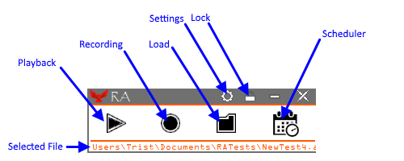
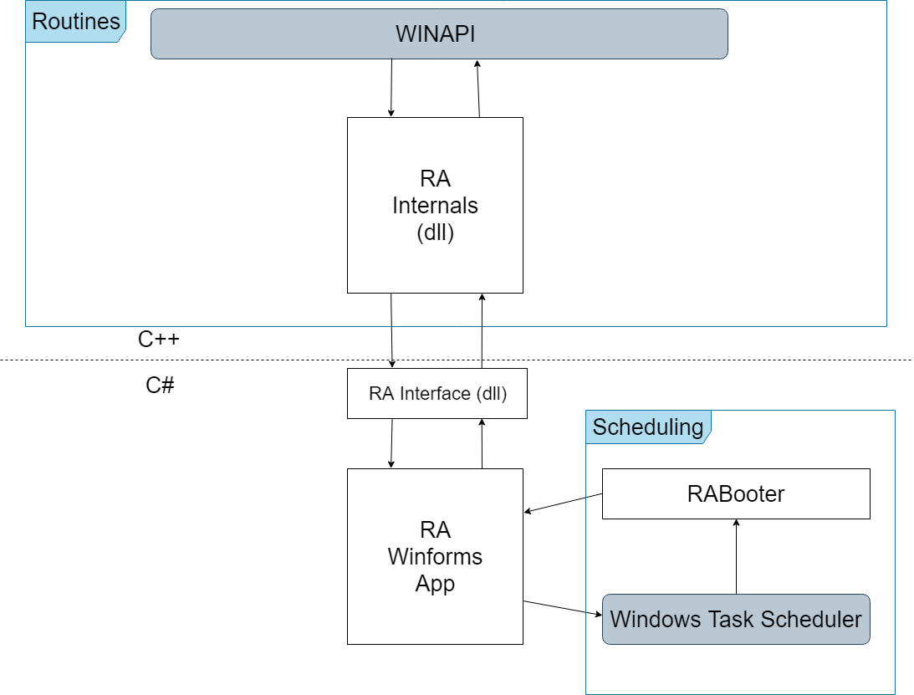
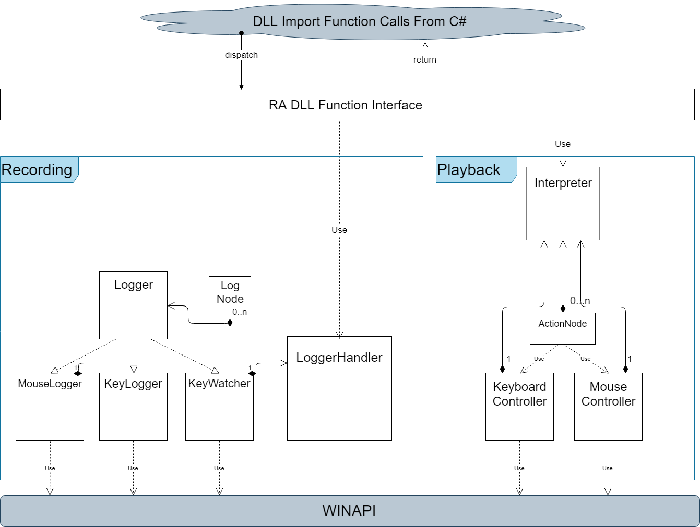

#  RA - Routine Automation

RA is a lightweight application for automating simple tasks on Windows machines.

Additionally, the RAInterface.dll(C#) or RAInternals.dll(C++) expose the recording/playback functionality for easy integration into any existing C# or C++ based Windows applications.

# Getting Started

## Using the Windows Application

x64 Download: ! Download Link Coming Soon !

x86 Download: ! Download Link Coming Soon !

Unzip the archive from one of the download links above. The RA.exe file will start the application. In order for everything to work properly, the following files need to be in the same directory:

- RAInterface.dll
- RAInternals.dll
- RABooter.exe
- Microsoft.Win32.TaskScheduler.dll
- RA.exe

## Using the RAInternals library

There's two ways to integrate the functionality I've built out for recording/playback into your own applications.

 For C#, make sure the RAInternals.dll and RAInterface.dll are in the same directory, then just add a reference to the RAInterface.dll into your project.

```csharp
using RAInterface;

namespace Dummy {
    public class DummyClass {
        private RAController raControl = new RAController();
        
        public void dummy(){
            //This function calculates how long an automated routine is
            raControl.calculateRuntime("dummyfilepath");

            //The params for this are virtual key codes
            //This function watches for the key codes passed to it, and blocks the thread until all of them are pressed down at the same time.
            raControl.watchForStartSequence(new[] {177, 32, 0, 0});

            //The params for this are virtual key codes
            //This function is used to stop a thread that's 
            //currently executing an automated routine
            raControl.interruptInterpreterSequence(new [] {177,32,0,0});

            //This function spins up the loggers and will generate an automated routine file
            raControl.recordActivity("dummyfilepath");

            //filepath, speed, loops
            raControl.executeAutomatedRoutine("dummyfilepath",1,1);

        }
    }
}
```


# Functionality


This is the main view for RA. The UI for RA is very straightforward, with all of the application's functionality available from this view. This results in an application that's easy to use, and isn't TOO bad on the eyes. 

## Recording 
Press the Record button to start the recording process for a new automated routine. Immediately, you'll see a standard file browser so you can choose what to call this new automated routine. After that, application will be in the "Waiting" state, indicating that it is waiting for your Control Macro to start. The control macro is a keybinding that can be configured from the settings menu, and allows you to trigger start/stop actions in RA. This process exists to allow you to get everything set up and in the "Waiting" state so that you can then minimize RA and trigger the recording start/stop regardless of what application is focused.

## Playback
To play an automated routine, first click on the Load button and select the file you want to play. This will change the currently selected file and you should see your file's path scroll across the bottom text panel. Once a file's been selected, the playback button can be used to start the automated routine. 


When manually starting an automated routine, you can configure the speed at which it plays as well as how many times it will loop.

## Scheduling


RA supports the ability to schedule automated routines to play at arbitrary times and on certain intervals. These scheduled routines will wake the computer up, launch RA, and then execute. They can be canceled mid-playback by using your control macro - the same as any other automated routine. This is done through the Windows Task Scheduler, so the scheduled routines can be viewed there for a more verbose description.

# How it works


The application's "front-end" is a C# WinForms app. It was designed using Visual Studio and primarily makes calls out to the RAInterface library. Additionally, the WinForms app also has a small utility class it uses that wraps Microsoft.Win32.TaskScheduler in order to interact with the task scheduler.

RAInterface is a small library that wraps the functions exported from the RAInternals dll so that they are easier to use in C#.

## RAInternals

This is where most of everything happens. The WINAPI exposes functionality for intercepting input as well as sending arbitrary input back to Windows, which is the majority of what this application needs to do.

### Recording
For recording, there's 3 "Loggers" that handle all of the actual recording input via hooks. The MouseLogger/KeyLogger classes record input by creating LogNodes and the KeyWatcher class monitors input to trigger start/stops when the input corresponds to the control macro. The LoggerHandler contains all three loggers, controls starting/stopping the hooks, and creates the output file from the LogNodes the MouseLogger/KeyLogger generate.

### Playback
For playback, the KeyboardController/MouseController handle sending artificial input to Windows. Each ActionNode has an execute function that uses a function from the KeyboardController or the MouseController e.g. MoveMouse, KeyPress, KeyRelease. The Interpreter parses in the automated routine file and creates a linked list of ActionNodes. When each ActionNode is executed in succession, it will recreate the recorded activity.
